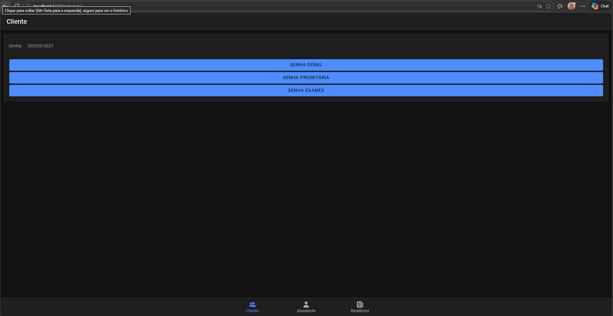
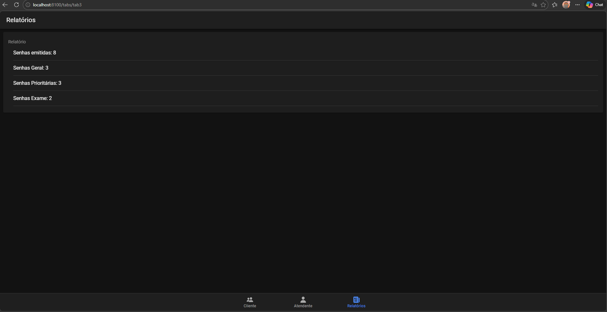
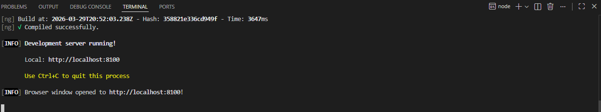

# 🎟️ Projeto Mobile Tickets

Este repositório contém o código do aplicativo **Mobile Tickets**, desenvolvido como entrega do projeto para a disciplina do Prof. João Ferreira.

## 📱 Sobre o Projeto
O projeto é um aplicativo mobile criado do zero utilizando o framework **Ionic** com **Angular**. O objetivo foi estruturar o ambiente de desenvolvimento, criar a interface das telas solicitadas e realizar o versionamento de código completo utilizando **Git** e **GitHub**.

## 🛠️ Tecnologias Utilizadas
* **Ionic Framework**
* **Angular**
* **TypeScript / HTML / SCSS**
* **Git & GitHub** (Versionamento na nuvem)

## 📸 Telas do Aplicativo

Abaixo estão as capturas de tela mostrando o funcionamento e o layout das páginas desenvolvidas:

### Tela 1

### Tela 2

### Tela 3

Vinicius Barbosa Guimarães Almeida
01770124

